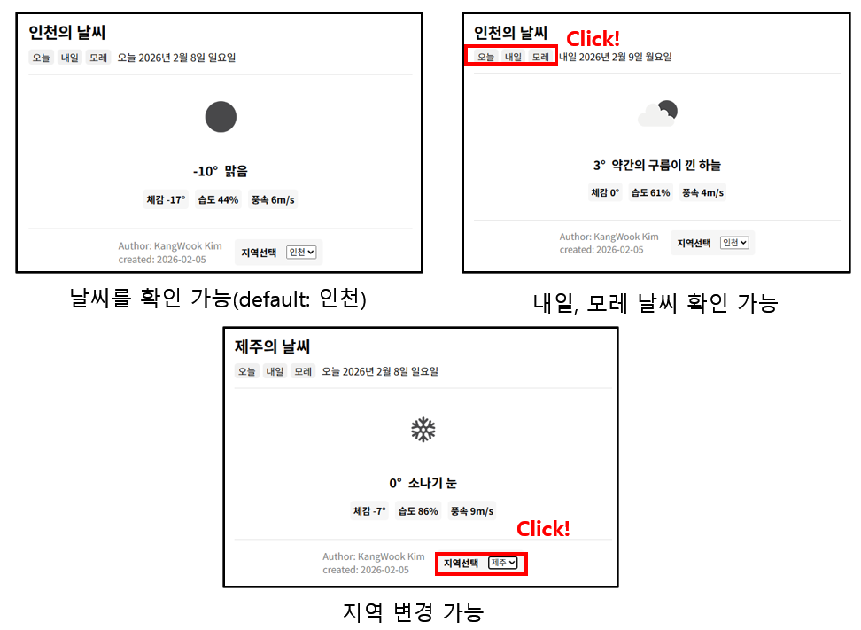

## 날씨 프로젝트
도시를 선택하여 해당 도시의 날씨를 확인할 수 있다.

## openWeather API 연습
- axios 라이브러리를 이용한 API 호출
- 파일 분리 연습

## 파일 설명
- src/api/weather.js: API 호출 함수
- src/componets/*.jsx: Header, Weather, Footer 컴포넌트
- src/util/*.js: 함수 모듈화 (요일 계산, 도시 이름 번역 함수)

## 핵심 구현
- 내일, 모레 날씨 데이터를 불러오는 방법은, API 호출 시, ${BASE_URL}/forecast를 사용한다.
- 위와 같이 사용할 경우, 3시간 간격으로 저장된 데이터들이 배열로 담겨있다.
- 각 원소마다 key 값인 dt_txt에는 예측한 날의 날짜,시간 정보가 담겨 있으므로, 배열의 find 함수를 이용하여 내가 원하는 날의 데이터를 가져올 수 있다.

## UI

